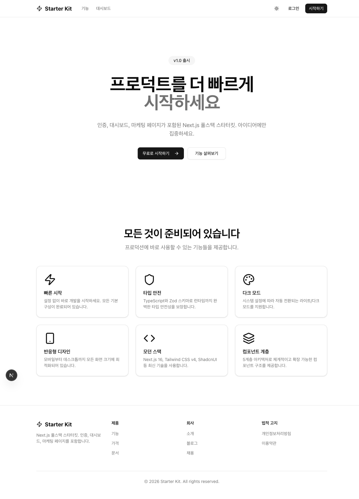
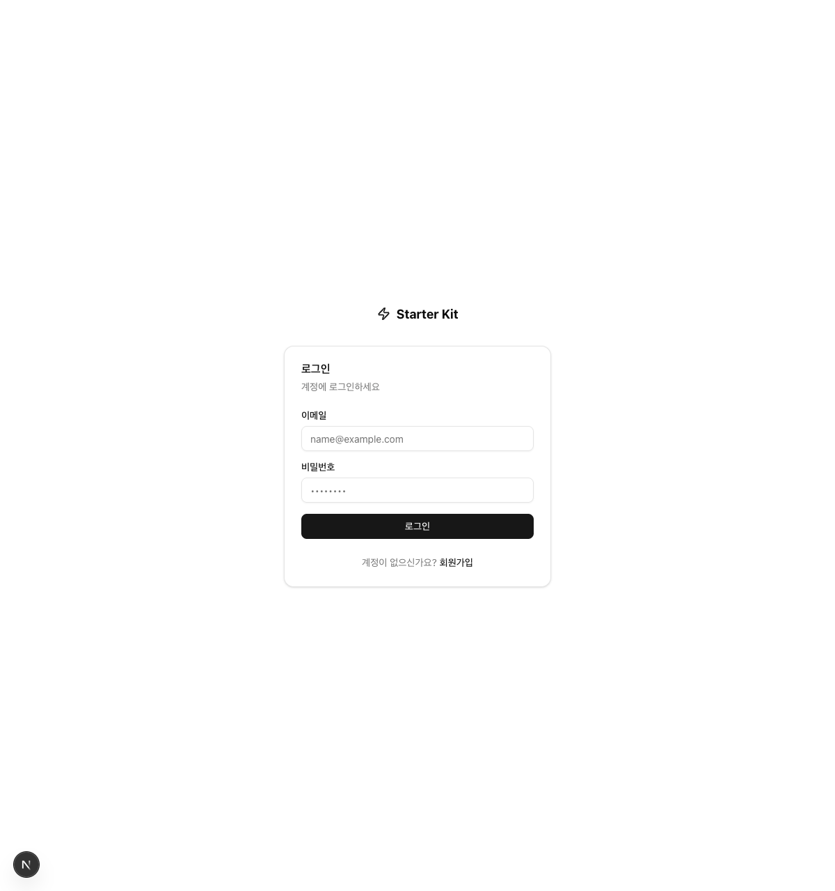
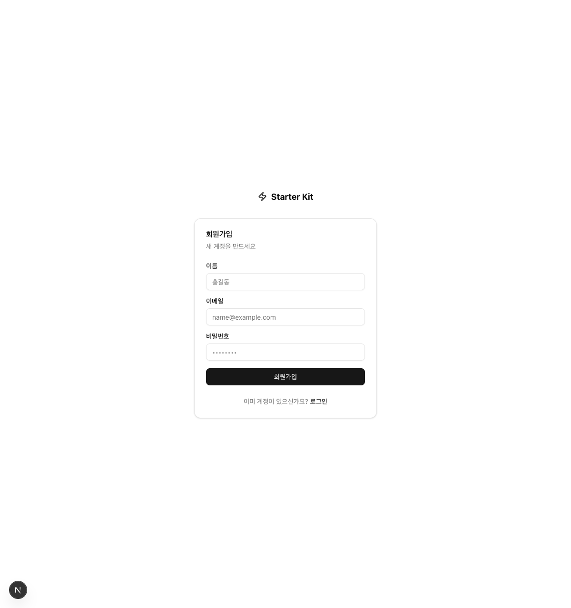
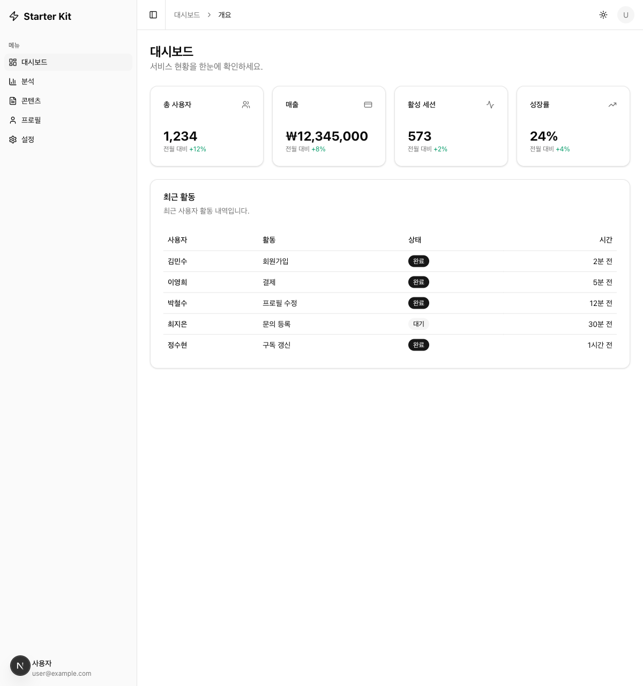

# Starter Kit

Next.js 16 기반 풀스택 스타터킷입니다. 마케팅 페이지, 인증, 대시보드를 포함하며 바로 SaaS 개발을 시작할 수 있습니다.

## Screenshots

| 홈 | 로그인 | 회원가입 | 대시보드 |
|:---:|:---:|:---:|:---:|
|  |  |  |  |

## Tech Stack

| 카테고리 | 기술 |
|----------|------|
| **프레임워크** | Next.js 16 (App Router) |
| **언어** | TypeScript (Strict Mode) |
| **UI** | shadcn/ui, Radix UI, Lucide Icons |
| **스타일링** | Tailwind CSS 4, CSS Variables (OKLCH) |
| **폼** | React Hook Form + Zod |
| **테마** | next-themes (다크모드 지원) |

## Project Structure

```
app/
├── (marketing)/     # 마케팅 페이지 (SiteHeader + SiteFooter)
├── (auth)/          # 로그인/회원가입 (중앙 정렬, 네비게이션 없음)
│   ├── login/
│   └── register/
├── (dashboard)/     # 대시보드 (Sidebar 레이아웃)
│   └── dashboard/
├── layout.tsx       # 루트 레이아웃 (ThemeProvider, Toaster)
└── globals.css

components/
├── ui/              # shadcn/ui 컴포넌트
├── marketing/       # site-header, site-footer, hero, features
├── dashboard/       # app-sidebar, dashboard-header
└── providers/       # ThemeProvider

config/
├── site.ts          # 네비게이션, 푸터 설정
└── dashboard.ts     # 사이드바 메뉴 설정

types/
└── index.ts         # SiteConfig, NavItem, DashboardConfig
```

## Getting Started

```bash
# 의존성 설치
npm install

# 개발 서버 실행
npm run dev
```

[http://localhost:3000](http://localhost:3000)에서 확인할 수 있습니다.

## Scripts

| 명령어 | 설명 |
|--------|------|
| `npm run dev` | 개발 서버 실행 |
| `npm run build` | 프로덕션 빌드 |
| `npm run lint` | ESLint 실행 |
| `npm start` | 프로덕션 서버 실행 |

## Architecture

### Route Groups

각 route group은 독립적인 `layout.tsx`를 가지며, 용도에 맞는 레이아웃을 제공합니다.

- **`(marketing)`** — 공개 페이지. SiteHeader + SiteFooter로 감싸짐
- **`(auth)`** — 인증 페이지. 중앙 정렬 레이아웃, 네비게이션 없음
- **`(dashboard)`** — 인증 후 영역. SidebarProvider + AppSidebar 레이아웃

### Config → Type → Component 패턴

설정 파일(`config/`)에서 네비게이션, 사이드바 메뉴를 정의하고, 타입(`types/`)으로 구조를 보장하며, 컴포넌트가 config를 매핑하여 자동 렌더링합니다.

```
config/site.ts → types/index.ts → components/marketing/site-header.tsx
config/dashboard.ts → types/index.ts → components/dashboard/app-sidebar.tsx
```

## License

MIT
